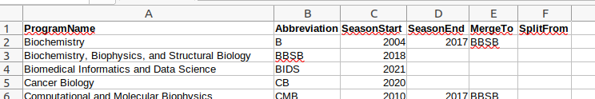

```@meta
CurrentModule = AdmitConfiguration
```

# AdmitConfiguration

Configuring AdmissionSuite is more complex than for typical packages (most of which require no configuration at all). To work seamlessly with your admissions system, it must

- know the names and some information about the programs for which you are offering admissions
- be able to connect to your database of applicants and run queries
- be able to parse the tables in whatever format your institution has chosen for representing the data

Each of these requires custom configuration.

## Configuring your programs

!!! info
    This step only needs to be performed once when you first use `Admit` or `AdmissionTargets`.
    If you restructure your programs, you'll want to reconfigure to match the current programs.

Using a spreadsheet program, create a table that, at a minimum, has a single column called `Abbreviation` and more comprehensively may have some or all of the following columns:



The `Abbreviation` column must list all your programs. This should be whatever "tag" you like to use to refer to each program, and should not be too long as it will need to fit in dropdown boxes in `Admit`. Full names can optionally be listed in `ProgramName`, and indeed this must be set if your database stores records by full program names. For the remaining columns, see the documentation on [`set_programs`](@ref).  If you need a complete example, see the file `examples/WashU.csv` within this package repository.

Once done, save the table in [Comma-separated value (CSV) format](https://en.wikipedia.org/wiki/Comma-separated_values) using your spreadsheet program's "Save as" or "Export" functionality. Then, in Julia execute the following set of statements:

```julia
using AdmissionSuite, AdmitConfiguration
using CSV
set_programs("/path/to/saved/file.csv")  # replace this with the specific path to your CSV file
```

You are now done configuring your programs.

## Configuring database access

!!! info
    This step only needs to be performed once to establish connectivity to your SQL database.
    If you change your server URL or other features, you may need to redo these steps.

`Admit` can directly query applicant records through a SQL interface. This has been tested on Windows and Linux, but may work with small modifications on Mac.

To use this feature, several configuration steps are required. Most of these may not be necessary if you are running Admit from a machine that can already access your database.

### [If your machine already has access to the database](@id conncheck)

If your system can already access the SQL database via a "data source" (DSN), just check whether you have access from Julia:

```
julia> using AdmissionSuite, Admit

julia> conn = connectdsn(<dsnname>)
```

where you replace `<dsnname>` with the name of your DSN (for example, `connectdsn("DBBS")` if you've created a DSN called "DBBS"). This will prompt you for your user name and password before attempting to connect to the SQL server.
If this returns without an obvious error, all is well and you can skip below to the section on [setting up automatic connections](@ref automatic).

!!! warning
    While it's possible to store your username and password in your DSN configuration, this is a [security hole](https://www.microsoft.com/en-us/microsoft-365/blog/2011/04/08/power-tip-improve-the-security-of-database-connections/) and not recommended.
    For this reason, `Admit` will always prompt you for your user name and password.

If you do not already have access via a DSN, the next sections describe how to configure it.

### [Installing an ODBC driver](@id driver)

If necessary, install the [SQL Server ODBC driver](https://docs.microsoft.com/en-us/sql/connect/odbc/download-odbc-driver-for-sql-server).

#### Windows


#### Other platforms

- From the [link above](@ref driver), download the MSODBC package for your platform and install it
- Find the library file on your system
- Start Julia and execute the following:

```julia
julia> using AdmissionSuite

julia> libpath = "/opt/microsoft/msodbcsql17/lib64/libmsodbcsql-17.4.so.1.1"

julia> ODBC.adddriver("MSODBC", libpath)
```

where `libpath` should be the path to the library on your own system. Library files have `dll`, `dylib`, or `so` in their extension.

Now `"MSODBC"` is a shortcut for the actual driver library.

### Configuring the Data Source (DSN)

#### From within the ODBC configuration utility (Windows)


#### From within Julia

This approach can be used on non-Windows platforms. After [installing the driver](@ref driver), execute

```julia
julia> using AdmissionSuite    # not needed if you've already done this in the same session

julia> ODBC.adddsn(<dsnname>, "MSODBC"; SERVER=<SQL server URL>, DATABASE=<database name>)
```

The items between `<>` are items you need to fill in. For example, for WashU's DBBS the line looks something like this:

```julia
julia> ODBC.adddsn("DBBS", "MSODBC"; SERVER="someurl.wustl.edu", DATABASE="DBBS")
```

Now, `<dnsname>` (`"DBBS"` in the example above) is a shortcut for the DSN.

!!! warning
    Putting your user name and password into the DSN configuration is a [security hole](https://www.microsoft.com/en-us/microsoft-365/blog/2011/04/08/power-tip-improve-the-security-of-database-connections/) and not recommended.

#### Checking your setup

Check your connection described [above](@ref conncheck).

### [Making your connection automatic](@id automatic)

Once you have a DSN, use

```julia
julia> using AdmissionSuite, AdmitConfiguration

julia> set_dsn(<dnsname>)
```

Henceforth `Admit` will connect to the database as needed, all you have to do is respond to password prompts.

## Configuring your data tables

Once you can connect to the database, the final step is to configure the ability to extract information from
the tables within it. Interally, AdmissionSuite converts the table into a [DataFrame](https://dataframes.juliadata.org/stable/), which is similar to
a spreadsheet. AdmissionSuite needs to know the names of the columns from which it can extract particular pieces of information.

Extractors come in two flavors: "by name" and "custom function". The latter are used in more complex situations
where you might need to reference multiple columns in order to extract a particular item.

### "By name" columns

"By name" configuration is done with [`set_column_configuration`](@ref); see its documentation for details.

### "Custom function" configuration

These require that you write a few Julia functions and save them to a file. You then register these functions
with [`set_local_functions`](@ref); see its documentation for details about which functions need to be implemented and examples of how to write them.

If this step is daunting, seek help from a local Julia user or contact Tim Holy (WashU) for assistance.
