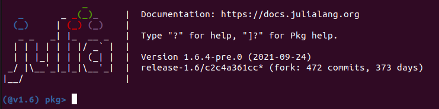
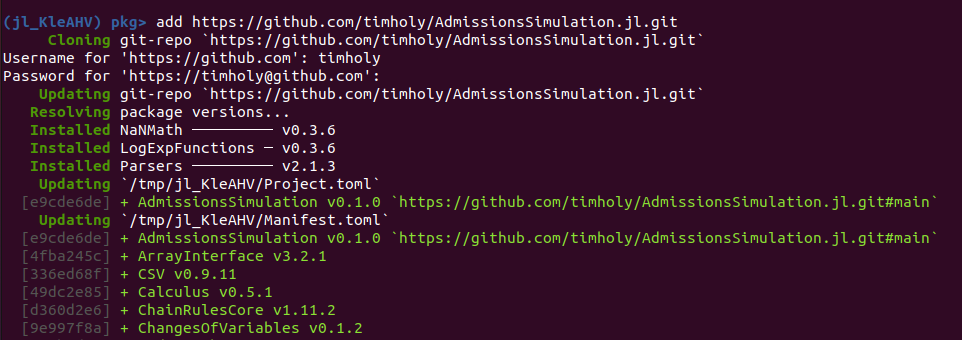

# Installation

## Install Julia

AdmissionsSimulation is written in [Julia](https://julialang.org/), a free, modern, high-performance language that excels for
analytics and machine learning. Visit the Downloads page and install either:

- the "LTS" = "Long Term Support" version
- the current stable release

Pick the appropriate version for your computer (unless you know otherwise, you should choose the "64-bit" version).

## Launch Julia and add this package

Unlike most Julia packages you'd use, this one is not "registered," so the line to add this package is slightly more complex.
After starting Julia, you should see something like this:


At that point, hit ']' to enter "package mode":



Then enter the following line:

```
add https://github.com/timholy/AdmissionsSimulation.jl.git
```

You should see something that starts like this:



(There may be small details that differ, and that's OK.) After the wheels stop spinning, your package is installed.

