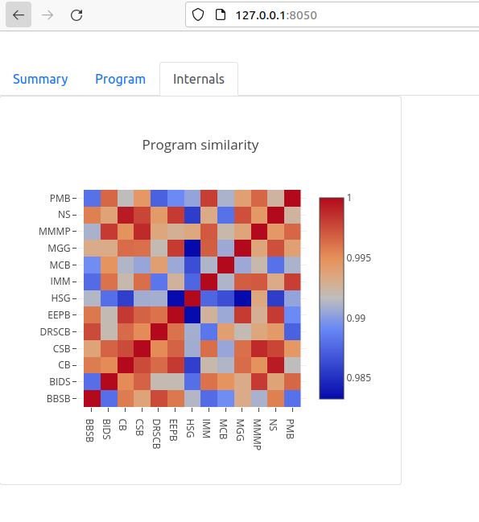

# Web application to manage the admissions season

The web application can run locally on an ordinary laptop or desktop machine. It should be configured for your programs and have access to the database of applicant records and program history (see [AdmitConfiguration](@ref)). Once the web application is running, type the URL into a browser window; if you're running the application on your local machine, this is just `http://localhost:8050`

Launching the webapp shows something like the following (fake applicant data were used for these screenshots):

The application opens on the "Summary" tab, which gives an overview across all programs. In the top right, you can adjust the target (if needed) and update the status of applicants from the database by clicking the "Refresh applicants" button.
The report shows the current estimated class size (`mean ± stddev`) along with the overall state of each program.
"# accepts" and "# declines" are counts of applicants who have received an offer and already rendered their decision;
"# pending" is the number of offers that have been issued to candidates who have not yet made a decision.
"# unoffered" is the number of students on the wait-list. "Priority" is a measure of the priority of each program in
receiving offers, given the current state; higher numbers indicate greater urgency in extending additional offers from the wait list.

If you scroll down the page, you'll see something like the following:

This is the list of wait-listed candidates to whom the algorithm suggests extending offers immediately.
Typically this may be empty or just a few students, if the bulk of offers have already been extended.
If you offer admission to these candidates, once the database is updated, click "Refresh applicants" to update the current status and projections. Note that projections are generated by simulation, and differences across simulation runs
introduces a small element of randomness, so you may see subtle changes each time you click "Refresh applicants."

Clicking on the program tab reveals more information about candidates for a specific program, as chosen by the dropdown at the top-right (here "MCB"):

This shows candidates who have accepted or rejected the offer of admission, along with a predicted matriculation probability for each undecided applicant.

Finally, "Internals" provides information about the model details, currently just the "Program similarity" score which expresses the use of cross-program data in predicting matriculation probability:

